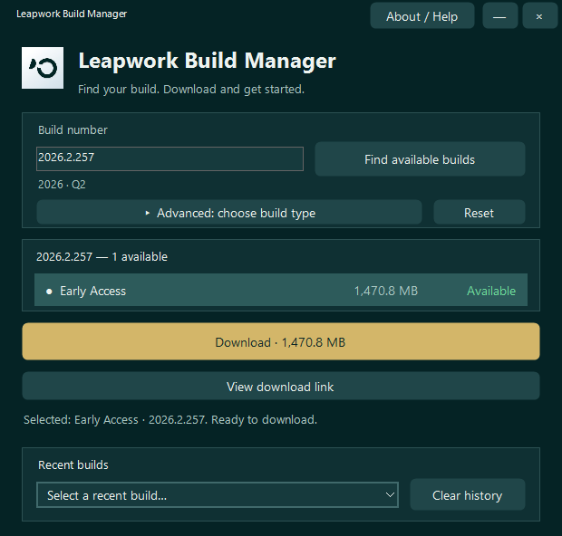

# Leapwork Build Manager v1.22

[**Download latest portable EXE**](https://github.com/leapwork-sagar/LeapworkBuildManager/releases/latest/download/LeapworkBuildManager.exe) · [Release notes and checksums](https://github.com/leapwork-sagar/LeapworkBuildManager/releases/latest)

[](https://github.com/leapwork-sagar/LeapworkBuildManager/actions/workflows/windows.yml)

Find available Leapwork builds and download their installers from a portable Windows application.
Enter build digits (dots are added automatically), search, select a result and download.
Advanced mode checks a manually selected build type.



*Screenshot uses illustrative build data; availability and size depend on the selected build.*

## Quick start

1. Download `LeapworkBuildManager.exe` above. Optionally verify it against `SHA256SUMS.txt` on the release page.
2. Run it on Windows with **.NET Framework 4.7.2 or later** installed. No installation or SDK is needed.
3. Enter build digits, for example `20262257` becomes `2026.2.257`, then select **Find available builds**.
4. Select a result, choose **Download**, and pick a destination. Use **Open folder** after completion.

Internet access is needed to check and download builds. **Advanced** checks only your chosen build type.

## Running and sharing

Share **LeapworkBuildManager.exe** directly. Windows and **.NET Framework 4.7.2 or later**
are required; the runtime is not bundled. No adjacent configuration or SDK is needed.
The executable is unsigned. Downloads restart when retried; resume is not supported.
Settings/history and logs are stored under `%LOCALAPPDATA%/LeapworkBuildUrlGenerator`.
Close an older running release first, otherwise its existing window is activated.
Reopen the app after changing Windows display scaling.

## Development

Open `LeapworkBuildManager.sln` in Visual Studio, or run `./scripts/build.ps1`
from PowerShell on Windows to compile and run all regression suites. No NuGet restore
is needed. The solution builds the production project; tests run through the script.

Contribute through a pull request to `main`. The required `test` check in
**Windows build and tests** runs regression tests and MSBuild on `windows-latest`.
See [Contributing](CONTRIBUTING.md).

```text
src/LeapworkBuildManager/
  Application/  Models/  Services/  Persistence/  Diagnostics/  Assets/
  UI/Forms/Main/  UI/Forms/Dialogs/  UI/Formatting/  UI/Controls/  UI/Styling/
tests/Application/  tests/Services/  tests/Diagnostics/  tests/UI/  tests/Support/
scripts/    build, portable smoke test and release packaging
docs/       architecture, release instructions and Git readiness
artifacts/  generated build/test output (ignored)
releases/   generated EXE and ZIP packages (ignored)
```

## Documentation

- [Current architecture](docs/ARCHITECTURE.md)
- [Build and release instructions](docs/RELEASING.md)
- [Release history](CHANGELOG.md)
- [Contribution guide](CONTRIBUTING.md)
- [Git readiness](docs/GIT_READINESS.md)

Tests simulate network responses and exercise local file operations and UI lifecycles.
They do not replace live Azure download, physical sleep/wake or SmartScreen testing.
Diagnostic redaction is best-effort; review exported reports before sharing them.
